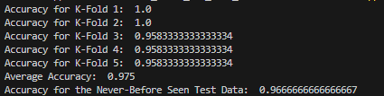

# Classification Pipeline with KNN

Responsibilities for are located in the attached PDF. My goal is to achieve higher than 75% accuracy with my model implementation!

## Step 1: Download the Iris Dataset
Downloaded the Iris Dataset from UC Irvine: [Iris](https://archive.ics.uci.edu/dataset/53/iris)

## Step 2: Data Processing

- **Feature Selection**: The Iris dataset has four features and one label. 
    - *Feature*: Sepal Length (continuous)
    - *Feature*: Sepal Width (continuous)
    - *Feature*: Petal Length (continuous)
    - *Feature*: Petal Width (continuous)
    - *Label*: class (independent variable)

There is no need to normalize the data, as the values range from ~6cm-10cm in all features. There are also no missing values, as verified by the dataset. 

```
           name     role         type demographic                                        description units missing_values
0  sepal length  Feature   Continuous        None                                               None    cm             no
1   sepal width  Feature   Continuous        None                                               None    cm             no
2  petal length  Feature   Continuous        None                                               None    cm             no
3   petal width  Feature   Continuous        None                                               None    cm             no
4         class   Target  Categorical        None  class of iris plant: Iris Setosa, Iris Versico...  None             no
```

### PCA to reduce dimensions
In PCA, n_components is the "number of components to keep".[1](https://scikit-learn.org/stable/modules/generated/sklearn.decomposition.PCA.html) It takes the first n number of principal components. With many attributes it can be difficult to visualize data. Usually more than 90% of vairance can be explained by two/three principal components. [2](https://www.geeksforgeeks.org/implementing-pca-in-python-with-scikit-learn/)

We will split the features into 2 principal components- squishing our 4 dimensions into 2 to help limit the 'curse of dimensionality'. These principal components are linear combinations of the original variables that have the maximum variance compared to other linear combinations. Essentially capturing as much information from the original dataset as possible. 

PC1, or principal component 1, is the direction in space along which the data points have the highest, or most, variance. 

PC2 accounts for the next highest variance in the dataset and it must be uncorrelated with PC1. (correlation(PC1,PC2) = 0)

## Model Training 
Choose an appropriate distance or similarity measure for KNN.

I am going to use stratified cross-validation to make sure that each of my k-fold's have 30 instances split with 10 of each flower.

For this I will use train-test-split, with stratify set to the label and the test_size set to 0.2. This is because I am trying for 1 validation, which will come from 4 training sets, and 1 test set, for a total of 5 sets total out of 150 instances.

## Output EX:



Output for code and graphing data is shown for the designations of flora. 

Tuning the k parameter lead me to a value of 5 with a minimum accuracy of .85 and a maximum of 1.0 (85%-100% accuracy). The average of the pictured trial was 0.95. All parameters are selected in a stratified, but random manner and a set of test data is excluded to run a final test on the k-fold tuned KNN. 

In the Setosa graph, pink dots with red text are test flowers from the set aside dataset that has not been seen by the training set. This subset of flower is usually classified correctly with KNN, as the graphing of data from PCA separates by a large euclidean distance. 

The colors of the testing Verginica are orange and Versicolor are purple. As you can see in the image below, a flower may have been incorrectly classified (a typically orange Verginica is purple- the classification of Versicolor). The testing accuracy for this case is shown below, where I had a 93% accuracy on flower classification.


