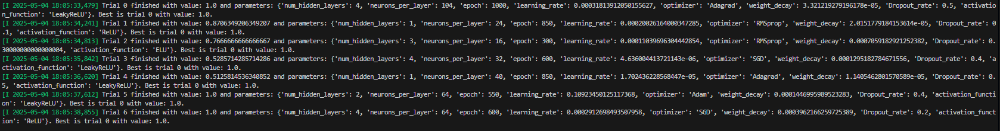
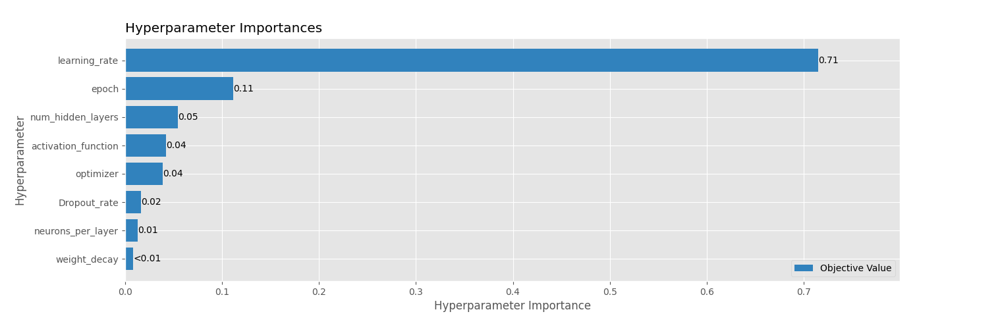
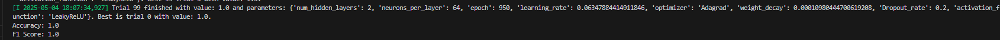

# Neural Network for the Iris Dataset
## 1. Data Preprocessing
*Apply the same preprocessing techniques used in previous assignments to prepare your data for training. This may include normalization, handling missing values, or feature selection.*

In Homework 2 (KNN) I did not normalize the dataset as the values range from ~6cm-10cm in all features. 

There are also no missing values in the dataset.
```python
           name     role         type demographic                                        description units missing_values
0  sepal length  Feature   Continuous        None                                               None    cm             no
1   sepal width  Feature   Continuous        None                                               None    cm             no
2  petal length  Feature   Continuous        None                                               None    cm             no
3   petal width  Feature   Continuous        None                                               None    cm             no
4         class   Target  Categorical        None  class of iris plant: Iris Setosa, Iris Versico...  None             no
```
I do not want to perform PCA on the dataset, as I believe the NN will be able to handle all features in training and I don't just want the principal components. I used ```LabelEncoder()``` to change labels into corresponding integer representations. Ex: Iris-versicolor = 1.

## 2. Model Training
- *Construct a neural network architecture suitable for your dataset and problem type (e.g.,classification or regression).*
- *Experiment with different hyperparameters to optimize model performance, including the learning rate, batch size, number of epochs, and layer structure.*

### Optuna
As any libraries are available to use, I am going to train my hyperparameters with Optuna- an open source Python Library that tries to study and optimize for the best parameters over 100 trials. I will describe the objective function it is trying to optimize below. You may need to install the library using: ```pip install optuna``` 

First, I split the testing and training data so there is no cheating.

#### Model for Optuna
The model for hyperparameter tuning needs to be dynamic. This means The number of layers, dropout rate, neurons, etc. must not be hardcoded but set to certain variables/ranges/functions (which will be listed below). 

```python 
class Iris_NN_Model(nn.Module):
    def __init__(self,input_feature,hidden_layer,output,neurons_per_layer,activation_func,dropout_rate):
        super(Iris_NN_Model, self).__init__()
        layers=[]
        for i in range(hidden_layer) :
            layers.append(nn.Linear(input_feature,neurons_per_layer))
            layers.append(nn.BatchNorm1d(neurons_per_layer))
            layers.append(activation_func)
            layers.append(nn.Dropout(dropout_rate))
            input_feature=neurons_per_layer
        layers.append(nn.Linear(neurons_per_layer,output))
        self.model=nn.Sequential(*layers)# unpack the list because sequential 
   
    def forward(self,x):
        return self.model(x)
```

#### Objective Function
```trial.suggest_*``` suggests ranges of values for various hyperparameters. I arbitrarily select a different number of epochs, hidden layers, etc. for the tuning to go through. The model is then initialized with the hyperparameters selected and will run on GPU if available or CPU. 

The model is trained for the specified number of epochs using the cross-entropy loss function (nn.CrossEntropyLoss).
Gradients are computed via backpropagation (loss.backward()), and the optimizer updates the model's parameters (optimizer.step()). 

The model is set to take in the 4 features (sepal length, sepal width, petal length, petal width) and output to 3 possible outputs (Iris-Verginica, setosa and versicolor). 

```python
# Model init
    input_dim=4 #input 4 features 
    output_dim=3 # Output 1 of 3 numbers
```

After training, the model is evaluated on the test dataset (x_test) in evaluation mode (model.eval()).
Predictions are generated, and the accuracy score is calculated using accuracy_score.

First, my Optuna study was created to maximize the accuracy score.
The study.optimize method runs the optimization process for 100 trials, testing different combinations of hyperparameters.


## 3. Testing and Model Evaluation
*Choose an evaluation metric appropriate for your task:*
- *For classification: accuracy, precision, recall, f1-score, etc.*
- *For regression: RMSE, MAE, R-squared, etc.*

*Report the evaluation results and analyze the model’s performance.*

The following were used to evaluate and analyze performance of the model.
- ```accuracy_score```: "Computes subset accuracy: the set of labels predicted for a sample must exactly match the corresponding set of labels in y_true." [Source](https://scikit-learn.org/stable/modules/generated/sklearn.metrics.accuracy_score.html)

- ```f1_score```: "The F1 score can be interpreted as a harmonic mean of the precision and recall, where an F1 score reaches its best value at 1 and worst score at 0. The relative contribution of precision and recall to the F1 score are equal." [Source](https://scikit-learn.org/stable/modules/generated/sklearn.metrics.f1_score.html)

The best score and corresponding hyperparameters:
```python
# Trial 1
[I 2025-05-02 17:07:23,248] Trial 0 finished with value: 1.0 and parameters: {'num_hidden_layers': 2, 'neurons_per_layer': 104, 'epoch': 450, 'learning_rate': 0.027312545062450254, 'optimizer': 'Adam', 'weight_decay': 8.490989936176525e-05, 'Dropout_rate': 0.2, 'activation_function': 'ReLU'}. Best is trial 0 with value: 1.0.
# Trial 2
[I 2025-05-02 17:13:11,741] Trial 2 finished with value: 1.0 and parameters: {'num_hidden_layers': 2, 'neurons_per_layer': 128, 'epoch': 950, 'learning_rate': 0.011559860972206445, 'optimizer': 'SGD', 'weight_decay': 7.004647057267131e-05, 'Dropout_rate': 0.2, 'activation_function': 'ReLU'}. Best is trial 0 with value: 1.0.
# Trial 3
[I 2025-05-02 17:13:13,964] Trial 3 finished with value: 0.9333333333333333 and parameters: {'num_hidden_layers': 4, 'neurons_per_layer': 80, 'epoch': 700, 'learning_rate': 1.7124362619118073e-05, 'optimizer': 'Adam', 'weight_decay': 1.4415973442891097e-05, 'Dropout_rate': 0.4, 'activation_function': 'ELU'}. Best is trial 0 with value: 1.0.
#
# 
# 
# Best Accuracy
1.0
# Best Trial Hyper Params
{'num_hidden_layers': 2, 'neurons_per_layer': 104, 'epoch': 450, 'learning_rate': 0.027312545062450254, 'optimizer': 'Adam', 'weight_decay': 8.490989936176525e-05, 'Dropout_rate': 0.2, 'activation_function': 'ReLU'}
```

Then, I tried to optimize with respect to f1-score:
```python
# Trial 1
[I 2025-05-02 17:16:00,691] Trial 0 finished with value: 1.0 and parameters: {'num_hidden_layers': 3, 'neurons_per_layer': 120, 'epoch': 950, 'learning_rate': 0.004948614912716559, 'optimizer': 'RMSprop', 'weight_decay': 0.0005145438738961834, 'Dropout_rate': 0.4, 'activation_function': 'LeakyReLU'}. Best is trial 0 with value: 1.0.
# Trial 2
[I 2025-05-02 17:16:01,681] Trial 1 finished with value: 1.0 and parameters: {'num_hidden_layers': 2, 'neurons_per_layer': 112, 'epoch': 750, 'learning_rate': 0.07847942848167094, 'optimizer': 'SGD', 'weight_decay': 1.9684521479685785e-05, 'Dropout_rate': 0.5, 'activation_function': 'ReLU'}. Best is trial 0 with value: 1.0.
# Trial 3
[I 2025-05-02 17:16:01,908] Trial 2 finished with value: 0.15343915343915343 and parameters: {'num_hidden_layers': 1, 'neurons_per_layer': 64, 'epoch': 250, 'learning_rate': 1.0863555026413742e-06, 'optimizer': 'Adagrad', 'weight_decay': 0.0007059723296937521, 'Dropout_rate': 0.2, 'activation_function': 'ReLU'}. Best is trial 0 with value: 1.0.
#
#
#
# Best F1 Score
1.0
# Best Hyperparameters
{'num_hidden_layers': 3, 'neurons_per_layer': 120, 'epoch': 950, 'learning_rate': 0.004948614912716559, 'optimizer': 'RMSprop', 'weight_decay': 0.0005145438738961834, 'Dropout_rate': 0.4, 'activation_function': 'LeakyReLU'}
```

From here, I created a new NN models where I set the hyperparameters to those selected by Optuna for the f1-score and accuracy.

```python
#Output to terminal
Accuracy: 1.0
F1 Score: 1.0
```

# Report
1. **Architecture Details: Provide a detailed description of your NN architecture, including the type and number of layers, number of nodes per layer, activation functions, loss function, and optimizer used.**

My neural network has 4 input layers, 3 output layers and it can decide the best number of hidden layers based on the dynamic input from optuna (however, 2 to 3 layers seem optimal). The activation function is decided by Optuna from a number of activation functions I fed into Optuna ("ReLU": nn.ReLU(), "LeakyReLU": nn.LeakyReLU(), "ELU": nn.ELU(), "Sigmoid": nn.Sigmoid()) and the optimization function can be Adam, SGD or RMSprop. The loss function is the ```nn.CrossEntropyLoss()``` which is just the cross entropy loss between input and target. The following is more in depth explanation of the architecture/ functions:

## Optimizers
Loss/ Error Function is calculated typically on the ouput layer.

A Loss function $L(y,\hat{y})$ typically takes 2 parameters: 
- **y**: The predicted output
- **$\hat{y}$**: The Ground truth output

 **OR**

It is a function of the input data:
$L(x,\hat{y},w)$
- **x**: input
- **w**: Network weights/parameters (vector)

### AdaGrad
Makes more progress in a direction based on whether it senses more progress in one axis than another. It may take a more direct route. Disadvantage: If the target is far away, we may have updated one parameter but need to make some in the other but the effective learning rate is overdecayed. It cannot increase the learning rate, only make smaller.

### RMSprop
Tried to keep a memory of previous gradient- if a large gradient is encountered it scales v down and reverse otherwise. Allows for non-permanently decayed rate.

### Adam
Model can find itself in local minima in RMSprop. ADAM - adaptive moment estimation.
Gradient jump is parallel to some vector

### SGD
Stochastic gradient descent. An iterative method for optimizing an objective function through minimization. It calculates the error and updates the model for each example in the training dataset.

## Activation
Typically, Optuna would select one of these 2 optimizers:

### ELU
"Apply the Exponential Linear Unit (ELU) function element-wise." (source: https://pytorch.org/docs/stable/generated/torch.nn.functional.elu.html)

ELUs have negative values which allows them to push mean unit activations closer to zero like batch normalization but with lower computational complexity. Mean shifts toward zero speed up learning by bringing the normal gradient closer to the unit natural gradient because of a reduced bias shift effect.ELUs saturate to a negative value with smaller inputs and thereby decrease the forward propagated variation and information. (source: https://paperswithcode.com/method/elu) 

### ReLU
Applies the rectified linear unit function element-wise; it typically outputs a value proportional to the input. This means that for any input value less than zero, the output will be zero, and for any input value greater than or equal to zero, the output will be the input value itself. This helps to mitigate the vanishing gradient problem and allows for fast learning. (source: https://www.restack.io/p/pytorch-knowledge-relu-activation)

2. **Comparative Analysis: Compare the performance and efficiency of your neural network with a previous model (e.g., a logistic regression or decision tree) used in HW2 or HW3. Discuss differences in results, model complexity, and computational requirements.**

My performance in my neural network was better than my KNN implementation. While KNN gave me a best accuracy of 96.7%, my neural network is capable of giving me 100% accuracy for classification on the same dataset. This indicated that my NN was able to better make connections between patterns of flowers than KNN might have, due to its reliance on local distances. 

Complexity wise, KNN is generally a simple algorithm. It just makes predictions based on a majority class. The neural network I coded is way more complex and tuning hyperparameters by hand is a pain (hence, I used Optuna). The weights it learns and the activation functions it tries, etc all make it so much more complex- yet it is much more flexible and obviously able to make better predictions. It takes a considerably longer time to run, especially for training the study for Optuna:

```python
# Optuna training then the best model output
Total time taken:  129.63469886779785
Total time taken for best model:  2.702720880508423
```

Versus run time for KNN:
```python
# This is on top of 5-Fold Cross Validation
Total time taken:  2.9992949962615967
```


Overall the NN takes a lot more computation time, especially during training, however it offers better accuracy and prediction results.

3. **Results and Visualization: Include code snippets, execution results, and screenshots to clearly demonstrate the process and final outputs of your NN model.**

Optuna study in terminal output:


We can graph the importance of the hyperparameters from the Optuna study:


```python
# Saves the study performed by Optuna to run as the NN for the testing data
best_params = study.best_params
best_model = Iris_NN_Model(
    input_feature=4,
    hidden_layer=best_params['num_hidden_layers'],
    output=3,
    neurons_per_layer=best_params['neurons_per_layer'],
    activation_func=activation_funct[best_params['activation_function']],
    dropout_rate=best_params['Dropout_rate']
)
best_model.to(device)
```
Final accuracy and F1-Score:
```python
#Output to terminal
Accuracy: 1.0
F1 Score: 1.0
```


4. **Insights and Learning: Reflect on what you learned through this assignment, including any new insights into neural networks, challenges faced in data preprocessing, model training, or parameter tuning, and potential improvements or different approaches you would consider.**

I learned that tuning hyperparameters by hand is a pain. It is better done with a pre-built library. I am grateful I didn't have to do much pre-processing of the dataset. I think I would have found it fun if I had to. The different kinds of functions used to activate and optimize were interesting. I think I would want to try a more difficult dataset in the future to really see how powerful neural networks can be. 


